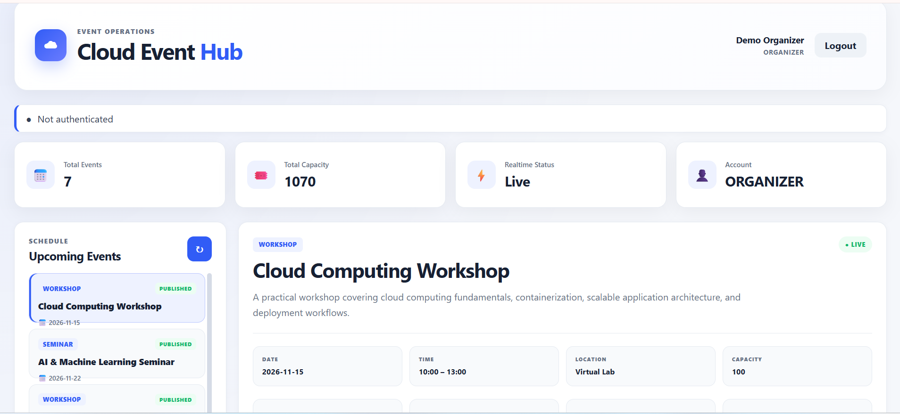
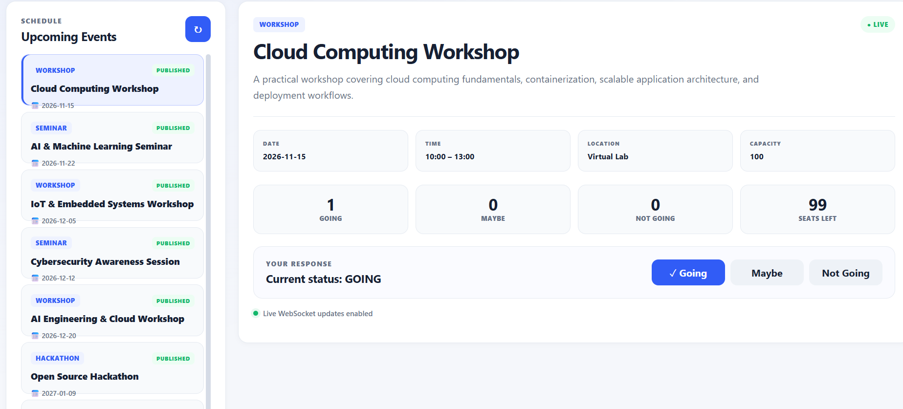
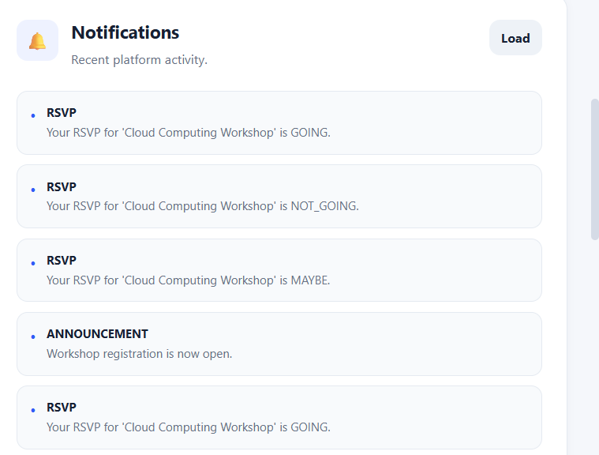
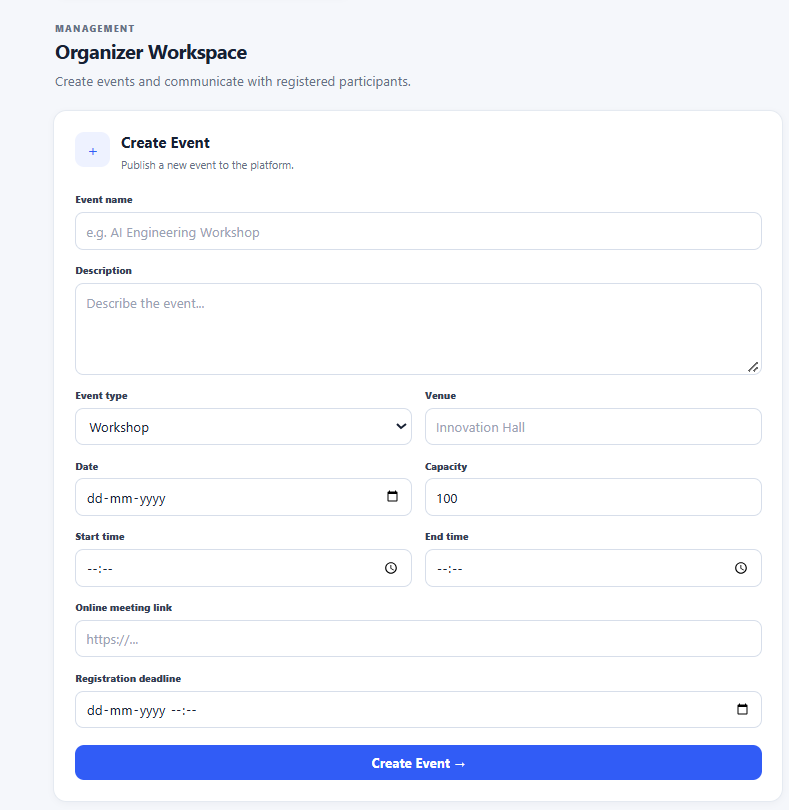
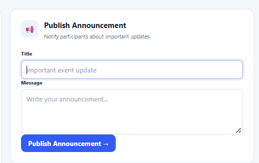
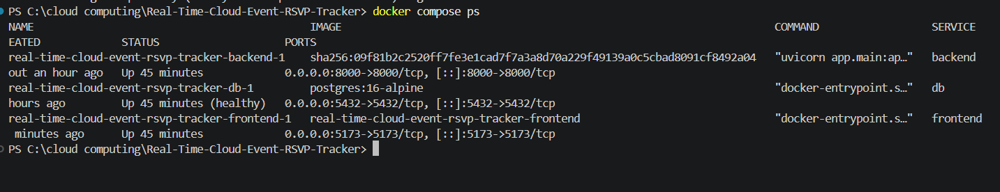
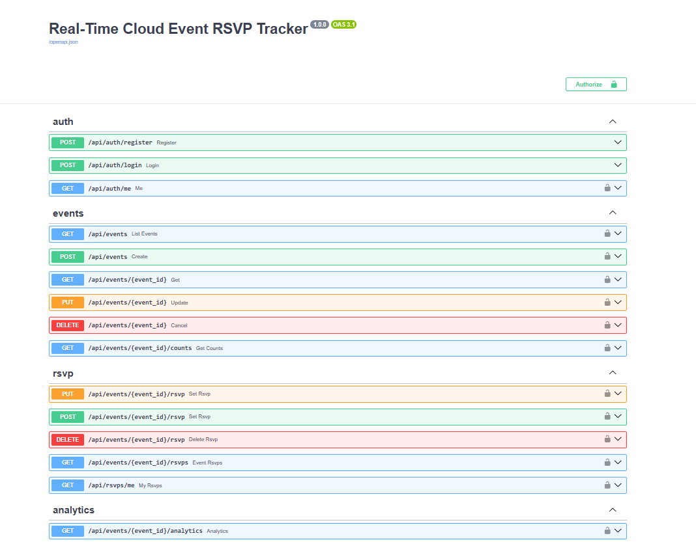
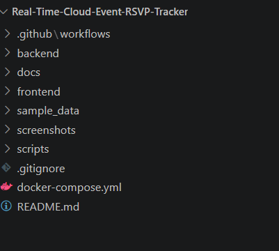

# ☁️ Real-Time Cloud Event RSVP Tracker

<p align="center">


</p>

<p align="center">
<strong>Full-stack real-time event management and RSVP platform built with React, FastAPI, PostgreSQL, WebSockets, JWT authentication, Docker, and GitHub Actions.</strong>
</p>

<p align="center">
A cloud-oriented software engineering project demonstrating authentication, authorization, REST APIs, relational database design, real-time communication, event management, RSVP workflows, automated testing, containerization, and continuous integration.
</p>

---

## 📌 Table of Contents

- [Project Overview](#-project-overview)
- [Problem Statement](#-problem-statement)
- [Proposed Solution](#-proposed-solution)
- [Project Objectives](#-project-objectives)
- [Key Features](#-key-features)
- [User Roles](#-user-roles)
- [Authentication](#-authentication)
- [Event Management](#-event-management)
- [RSVP Management](#-rsvp-management)
- [Capacity Management](#-capacity-management)
- [Real-Time WebSocket System](#-real-time-websocket-system)
- [Announcements](#-announcements)
- [Notifications](#-notifications)
- [Analytics and Statistics](#-analytics-and-statistics)
- [System Architecture](#-system-architecture)
- [Cloud Computing Concepts](#️-cloud-computing-concepts)
- [Technology Stack](#-technology-stack)
- [Database Design](#️-database-design)
- [Authentication Architecture](#-authentication-architecture)
- [REST API](#-rest-api)
- [Project Structure](#-project-structure)
- [Prerequisites](#-prerequisites)
- [Installation](#-installation)
- [Environment Variables](#️-environment-variables)
- [Running with Docker](#-running-with-docker)
- [Running Without Docker](#-running-without-docker)
- [Application URLs](#-application-urls)
- [API Documentation](#-api-documentation)
- [Testing](#-testing)
- [Continuous Integration](#️-continuous-integration)
- [Security](#-security)
- [Validation and Error Handling](#-validation-and-error-handling)
- [Real-Time Data Flow](#-real-time-data-flow)
- [Concurrency and Data Integrity](#-concurrency-and-data-integrity)
- [Screenshots](#-screenshots)
- [Demo Workflow](#-demo-workflow)
- [Sample Events](#-sample-events)
- [Engineering Highlights](#-engineering-highlights)
- [Scalability](#-scalability)
- [Failure Handling](#-failure-handling)
- [Testing Checklist](#-testing-checklist)
- [Current Limitations](#-current-limitations)
- [Future Improvements](#-future-improvements)
- [Learning Outcomes](#-learning-outcomes)
- [Resume Description](#-resume-description)
- [LinkedIn Description](#-linkedin-description)
- [Recommended GitHub Topics](#️-recommended-github-topics)
- [Documentation](#-documentation)
- [Project Status](#-project-status)
- [Author](#-author)

---

# 🚀 Project Overview

**Real-Time Cloud Event RSVP Tracker** is a full-stack event management platform designed to manage events, users, RSVP responses, event capacity, announcements, notifications, and real-time updates.

The system combines:

- ⚛️ React frontend
- ⚡ FastAPI backend
- 🐘 PostgreSQL database
- 🔐 JWT authentication
- 👥 Role-based authorization
- 🎟️ RSVP management
- 🚦 Capacity validation
- 🔄 WebSocket-based real-time updates
- 📢 Event announcements
- 🔔 Notifications
- 📊 Event statistics
- 🐳 Docker Compose
- 🧪 pytest
- ⚙️ GitHub Actions CI

The project demonstrates how frontend, backend, database, authentication, real-time communication, testing, and containerization can be integrated into one complete engineering system.

---

# 🎯 Problem Statement

Traditional event registration systems may rely on separate or manual processes for:

- Event creation
- Attendee registration
- RSVP tracking
- Capacity monitoring
- Event communication
- Attendance statistics

This can create problems such as:

- Delayed RSVP information
- Difficult capacity tracking
- Duplicate registration issues
- Limited organizer visibility
- Lack of real-time updates
- Fragmented event information
- Manual administrative work

The objective of this project is to provide a centralized platform for event management, RSVP tracking, capacity validation, notifications, analytics, and real-time communication.

---

# 💡 Proposed Solution

The system provides a centralized web-based event management platform.

### Attendees can:

- Register
- Login
- Browse events
- View event details
- Submit RSVP responses
- Change RSVP status
- Receive notifications

### Organizers can:

- Create events
- Manage events
- Publish announcements
- Monitor RSVP statistics
- Monitor event capacity

### Backend provides:

- Authentication
- Authorization
- Business logic
- Capacity validation
- REST APIs
- WebSocket communication
- Database persistence

### High-Level Flow

```text
                    ┌─────────────────┐
                    │      Users      │
                    └────────┬────────┘
                             │
                ┌────────────┴────────────┐
                │                         │
             Attendee                 Organizer
                │                         │
                ▼                         ▼
        Browse / RSVP             Create / Manage
                │                         │
                └────────────┬────────────┘
                             ▼
                    ┌─────────────────┐
                    │     React UI    │
                    └────────┬────────┘
                             │
                    REST + WebSocket
                             │
                             ▼
                    ┌─────────────────┐
                    │     FastAPI     │
                    │     Backend     │
                    └────────┬────────┘
                             │
                         SQLAlchemy
                             │
                             ▼
                    ┌─────────────────┐
                    │   PostgreSQL    │
                    └─────────────────┘
```

---

# 🎯 Project Objectives

The project was developed with the following objectives:

- Build a complete full-stack application.
- Implement secure authentication.
- Implement role-based authorization.
- Design a relational database.
- Build REST APIs using FastAPI.
- Implement real-time communication using WebSockets.
- Implement RSVP state management.
- Validate event capacity on the backend.
- Provide attendee and organizer workflows.
- Implement announcements and notifications.
- Provide event-level statistics.
- Containerize the application using Docker.
- Implement automated backend testing.
- Implement continuous integration.
- Maintain professional technical documentation.

---

# ✨ Key Features

## 🔐 Authentication

- User registration
- User login
- JWT access tokens
- Password hashing
- Protected API endpoints
- Authentication-aware frontend
- Token-based API authorization

---

## 👥 Role-Based Authorization

The application supports multiple roles:

| Role | Responsibility |
|---|---|
| `ATTENDEE` | Browse events and manage RSVP responses |
| `ORGANIZER` | Create and manage events |
| `ADMIN` | Administrative application role |

Authorization is enforced by the backend rather than relying only on frontend UI restrictions.

---

# 📅 Event Management

Organizers can manage events containing:

- Event name
- Description
- Event type
- Event date
- Start time
- End time
- Venue
- Online link
- Maximum capacity
- Registration deadline
- Event status

### Event Status

```text
DRAFT
PUBLISHED
FULL
COMPLETED
CANCELLED
```

The backend validates event information before processing it.

---

# 🎟️ RSVP Management

Attendees can submit and update RSVP responses.

### RSVP States

```text
GOING
MAYBE
NOT_GOING
```

The system maintains RSVP information in PostgreSQL.

A user-event relationship is modeled to prevent duplicate RSVP records.

### RSVP Workflow

```text
User
 │
 ▼
Select Event
 │
 ▼
Choose RSVP Status
 │
 ▼
React Frontend
 │
 ▼
FastAPI API
 │
 ├── Authentication Check
 ├── Event Validation
 ├── Capacity Validation
 └── RSVP Processing
          │
          ▼
      PostgreSQL
          │
          ▼
    Real-Time Update
          │
          ▼
    Connected Clients
```

---

# 🚦 Capacity Management

The application tracks event capacity and RSVP statistics.

Example dashboard information:

```text
Going
Maybe
Not Going
Seats Left
```

Capacity validation is performed on the backend because frontend state should not be treated as the authoritative source for business rules.

The backend validates:

- Event existence
- Maximum capacity
- RSVP state
- User authentication
- Event availability

---

# ⚡ Real-Time WebSocket System

Real-time communication is a core feature of the project.

The application uses WebSockets to communicate event updates to connected clients.

Instead of requiring users to manually refresh the application, connected clients can receive updates through an active WebSocket connection.

### Real-Time Architecture

```text
                 ┌─────────────────┐
                 │    Browser A    │
                 └────────┬────────┘
                          │
                       RSVP
                          │
                          ▼
                 ┌─────────────────┐
                 │     FastAPI     │
                 │     Backend     │
                 └────────┬────────┘
                          │
                          ▼
                 ┌─────────────────┐
                 │   PostgreSQL    │
                 └────────┬────────┘
                          │
                          ▼
                 ┌─────────────────┐
                 │ WebSocket Layer │
                 └────────┬────────┘
                          │
                 ┌────────┴────────┐
                 ▼                 ▼
        ┌─────────────────┐ ┌─────────────────┐
        │    Browser A    │ │    Browser B    │
        └─────────────────┘ └─────────────────┘
```

This demonstrates the integration of:

- REST APIs
- Database persistence
- Backend business logic
- WebSockets
- Frontend state management

---

# 📢 Announcements

Organizers can publish event-related announcements.

Potential use cases include:

- Schedule updates
- Important instructions
- Venue information
- Event reminders
- Organizer messages

Announcements are integrated into the event-management workflow.

---

# 🔔 Notifications

The application provides an in-platform notification workflow for authenticated users.

Notifications can communicate relevant event-related information to users.

---

# 📊 Analytics and Statistics

The application provides event-level statistics.

Example:

```text
┌─────────────────────────────┐
│       Event Statistics      │
├─────────────────────────────┤
│ Going              25       │
│ Maybe               8       │
│ Not Going           4       │
│ Seats Left         63       │
└─────────────────────────────┘
```

These statistics provide organizers with visibility into RSVP activity and event capacity.

---

# 🏗️ System Architecture

```text
                         ┌─────────────────────┐
                         │      React UI       │
                         │     Vite Frontend   │
                         └──────────┬──────────┘
                                    │
                              REST API
                                    │
                              WebSocket
                                    │
                                    ▼
                         ┌─────────────────────┐
                         │      FastAPI        │
                         │      Backend        │
                         ├─────────────────────┤
                         │ Authentication      │
                         │ Authorization       │
                         │ Event APIs           │
                         │ RSVP APIs            │
                         │ Announcement APIs    │
                         │ Notification APIs    │
                         │ Analytics APIs       │
                         │ WebSocket Service    │
                         └──────────┬──────────┘
                                    │
                                SQLAlchemy
                                    │
                                    ▼
                         ┌─────────────────────┐
                         │    PostgreSQL 16    │
                         │    Relational DB    │
                         └─────────────────────┘
```

### Docker Architecture

```text
                    Docker Compose
                          │
             ┌────────────┼────────────┐
             ▼            ▼            ▼
        ┌─────────┐  ┌─────────┐  ┌─────────┐
        │Frontend │  │ Backend │  │Database │
        │ :5173   │  │ :8000   │  │ :5432   │
        └─────────┘  └─────────┘  └─────────┘
```

---

# ☁️ Cloud Computing Concepts

The project demonstrates several cloud-oriented engineering concepts.

### Containerization

Docker packages application services into reproducible containers.

### Service Separation

The application separates:

```text
Frontend
Backend
Database
```

into independent services.

### Environment-Based Configuration

Runtime configuration is supplied using environment variables.

### API-Based Architecture

The React frontend communicates with the FastAPI backend through REST APIs.

### Persistent Storage

PostgreSQL provides persistent relational data storage.

### Real-Time Communication

WebSockets provide persistent communication channels for connected clients.

### Continuous Integration

GitHub Actions automatically validates backend tests and frontend builds.

---

# 🧰 Technology Stack

## Frontend

| Technology | Purpose |
|---|---|
| React | User interface |
| Vite | Frontend build tool |
| JavaScript | Application logic |
| HTML5 | Structure |
| CSS3 | Styling |
| Fetch API | REST communication |
| WebSocket API | Real-time communication |

## Backend

| Technology | Purpose |
|---|---|
| Python | Backend language |
| FastAPI | REST API framework |
| Uvicorn | ASGI server |
| Pydantic | Request validation |
| SQLAlchemy | ORM |
| JWT | Authentication |
| Passlib | Password hashing |
| bcrypt | Password hashing backend |

## Database

| Technology | Purpose |
|---|---|
| PostgreSQL 16 | Relational database |
| SQLAlchemy | Database ORM |

## DevOps

| Technology | Purpose |
|---|---|
| Docker | Containerization |
| Docker Compose | Multi-service orchestration |
| Git | Version control |
| GitHub | Repository hosting |
| GitHub Actions | Continuous integration |

## Testing

| Technology | Purpose |
|---|---|
| pytest | Backend testing |
| HTTPX | HTTP/API testing |
| FastAPI TestClient | API test execution |

---

# 🗄️ Database Design

PostgreSQL is used as the persistent relational database.

High-level relationship:

```text
                    ┌──────────────┐
                    │    Users     │
                    └──────┬───────┘
                           │
                ┌──────────┴──────────┐
                │                     │
                ▼                     ▼
         ┌──────────────┐      ┌──────────────┐
         │    Events    │◄────►│    RSVPs     │
         └──────┬───────┘      └──────────────┘
                │
       ┌────────┼────────┐
       ▼        ▼        ▼
Announcements Notifications Statistics
```

The system models:

- Users
- Roles
- Events
- RSVP records
- Event status
- RSVP status
- Announcements
- Notifications

---

# 🔐 Authentication Architecture

Authentication follows a JWT-based workflow.

## Registration

```text
User
 │
 ▼
Registration API
 │
 ▼
Validate User Data
 │
 ▼
Hash Password
 │
 ▼
PostgreSQL
```

## Login

```text
User Credentials
       │
       ▼
Authentication API
       │
       ▼
Verify Credentials
       │
       ▼
Generate JWT
       │
       ▼
Frontend
       │
       ▼
Authenticated Requests
```

Protected API requests use:

```http
Authorization: Bearer <access_token>
```

---

# 🌐 REST API

The backend provides REST APIs for application operations.

## Authentication

```http
POST /api/auth/register
POST /api/auth/login
```

## Events

```http
GET    /api/events
GET    /api/events/{event_id}
POST   /api/events
PUT    /api/events/{event_id}
DELETE /api/events/{event_id}
```

## RSVP

```http
POST /api/rsvps
GET  /api/rsvps
```

## Announcements

```http
POST /api/announcements
GET  /api/announcements
```

## Notifications

```http
GET /api/notifications
```

## Analytics

Analytics functionality is implemented through the backend analytics API module.

For the complete current API definition, see:

```text
docs/API.md
```

Interactive API documentation:

```text
http://localhost:8000/docs
```

---

# 📁 Project Structure

```text
Real-Time-Cloud-Event-RSVP-Tracker/
│
├── .github/
│   └── workflows/
│       └── ci.yml
│
├── backend/
│   ├── app/
│   │   ├── api/
│   │   │   ├── __init__.py
│   │   │   ├── analytics.py
│   │   │   ├── announcements.py
│   │   │   ├── auth.py
│   │   │   ├── deps.py
│   │   │   ├── events.py
│   │   │   ├── notifications.py
│   │   │   └── rsvps.py
│   │   │
│   │   ├── core/
│   │   │   ├── __init__.py
│   │   │   ├── config.py
│   │   │   └── security.py
│   │   │
│   │   ├── db/
│   │   │   ├── __init__.py
│   │   │   └── session.py
│   │   │
│   │   ├── models/
│   │   │   ├── __init__.py
│   │   │   └── models.py
│   │   │
│   │   ├── schemas/
│   │   │   ├── __init__.py
│   │   │   └── schemas.py
│   │   │
│   │   ├── services/
│   │   │   ├── __init__.py
│   │   │   └── realtime.py
│   │   │
│   │   ├── __init__.py
│   │   └── main.py
│   │
│   ├── tests/
│   │   ├── __init__.py
│   │   ├── conftest.py
│   │   └── test_api.py
│   │
│   ├── .env.example
│   ├── Dockerfile
│   └── requirements.txt
│
├── frontend/
│   ├── src/
│   │   ├── components/
│   │   ├── services/
│   │   │   └── api.js
│   │   ├── App.jsx
│   │   ├── Stats.jsx
│   │   └── main.jsx
│   │
│   ├── package.json
│   ├── package-lock.json
│   ├── Dockerfile
│   └── index.html
│
├── docs/
│   ├── API.md
│   ├── ARCHITECTURE.md
│   ├── DEMO_SCRIPT.md
│   ├── DEPLOYMENT.md
│   ├── PROJECT_REPORT.md
│   ├── ROADMAP.md
│   └── SCREENSHOT_CHECKLIST.md
│
├── screenshots/
│   ├── 01-dashboard-overview.png
│   ├── 02-event-details.png
│   ├── 03-rsvp-system.png
│   ├── 04-create-event.png
│   ├── 05-notifications.png
│   ├── 07-docker-services.png
│   ├── 08-fastapi-api.png
│   └── 09-project-structure.png
│
├── sample_data/
│
├── scripts/
│   └── demo.sh
│
├── .env.example
├── .gitignore
├── docker-compose.yml
└── README.md
```

---

# 💻 Prerequisites

Before running the project, install:

- Git
- Docker Desktop
- Docker Compose
- Node.js
- npm
- Python 3.12+ for local backend development

### Verify installation

```powershell
git --version
docker --version
docker compose version
node --version
npm --version
python --version
```

For Docker-based execution, Docker Desktop must be running.

---

# ⚙️ Environment Variables

Create a local `.env` file in the project root.

Example:

```env
POSTGRES_DB=event_tracker
POSTGRES_USER=event_tracker
POSTGRES_PASSWORD=your_secure_database_password

DATABASE_URL=postgresql+psycopg://event_tracker:your_secure_database_password@db:5432/event_tracker

JWT_SECRET=replace_with_a_long_random_secret

ACCESS_TOKEN_MINUTES=60

CORS_ORIGINS=http://localhost:5173

VITE_API_URL=http://localhost:8000
VITE_WS_URL=ws://localhost:8000
```

### ⚠️ Important Security Rule

Never commit your actual `.env` file.

Use:

```text
.env.example
```

as the safe configuration template.

---

# 🐳 Running with Docker

Docker Compose is the recommended method for running the complete application.

## 1. Clone the repository

```powershell
git clone https://github.com/sujalkrshaw/Real-Time-Cloud-Event-RSVP-Tracker.git
```

## 2. Enter the project

```powershell
cd Real-Time-Cloud-Event-RSVP-Tracker
```

## 3. Create `.env`

Copy the values from `.env.example` into a new:

```text
.env
```

file.

Use your own secure values for secrets and passwords.

## 4. Validate Docker Compose configuration

```powershell
docker compose config --quiet
```

If no error is returned, the configuration is syntactically valid.

## 5. Build the application

```powershell
docker compose build
```

## 6. Start the services

```powershell
docker compose up -d
```

## 7. Check service status

```powershell
docker compose ps
```

Expected services:

```text
frontend
backend
db
```

## 8. View logs

```powershell
docker compose logs
```

For backend logs:

```powershell
docker compose logs backend
```

For frontend logs:

```powershell
docker compose logs frontend
```

For database logs:

```powershell
docker compose logs db
```

---

# 🌐 Application URLs

After starting Docker Compose:

### Frontend

```text
http://localhost:5173
```

### Backend

```text
http://localhost:8000
```

### FastAPI Swagger

```text
http://localhost:8000/docs
```

### FastAPI ReDoc

```text
http://localhost:8000/redoc
```

---

# 👤 Demo Account

If the development/demo seed data in the current project provides the following account, it can be used for demonstration:

```text
Email:
organizer@example.com

Password:
Organizer123!
```

⚠️ These credentials are for local demonstration only. Do not use demonstration credentials in a production environment.

---

# 🌱 Sample Development Data

Example demonstration events can include:

```text
Cloud Computing Workshop
AI & Machine Learning Seminar
IoT & Embedded Systems Workshop
Cybersecurity Awareness Session
Open Source Hackathon
Engineering Project Showcase
```

These events can be used to demonstrate event management and RSVP workflows.

---

# 💻 Running Without Docker

Docker Compose is recommended for the complete stack.

For backend-only development:

## 1. Enter backend

```powershell
cd backend
```

## 2. Create virtual environment

```powershell
python -m venv .venv
```

## 3. Activate virtual environment

```powershell
.\.venv\Scripts\Activate.ps1
```

## 4. Install dependencies

```powershell
pip install -r requirements.txt
```

## 5. Start FastAPI

```powershell
uvicorn app.main:app --reload
```

Backend:

```text
http://127.0.0.1:8000
```

Swagger:

```text
http://127.0.0.1:8000/docs
```

---

# 🎨 Frontend Development

Navigate to:

```powershell
cd frontend
```

Install dependencies:

```powershell
npm install
```

Start the development server:

```powershell
npm run dev
```

Frontend:

```text
http://localhost:5173
```

### Production build

```powershell
npm run build
```

The generated build output is:

```text
frontend/dist/
```

---

# 📖 API Documentation

FastAPI automatically generates interactive API documentation.

Open:

```text
http://localhost:8000/docs
```

The Swagger interface allows developers to:

- Inspect endpoints
- Inspect request schemas
- Inspect response schemas
- Send test requests
- Test authentication
- Review API responses

Additional API documentation:

```text
docs/API.md
```

---

# 🧪 Testing

The backend includes automated pytest tests.

## Run tests locally

From the backend directory:

```powershell
pytest -q
```

## Run tests inside Docker

From the project root:

```powershell
docker compose exec backend pytest -q
```

The supplied project documentation reports a successfully verified Dockerized test suite.

Always rerun the tests after making implementation changes.

---

# 🏗️ Frontend Production Build

From:

```text
frontend/
```

run:

```powershell
npm install
```

then:

```powershell
npm run build
```

The production build is generated in:

```text
frontend/dist/
```

---

# ⚙️ Continuous Integration

The repository includes:

```text
.github/workflows/ci.yml
```

GitHub Actions can validate backend and frontend changes.

### Backend CI

```text
Checkout
   ↓
Setup Python
   ↓
Install dependencies
   ↓
Run pytest
```

### Frontend CI

```text
Checkout
   ↓
Setup Node.js
   ↓
npm ci
   ↓
npm run build
```

This provides an automated validation layer for repository changes.

---

# 🔒 Security

The project includes application-level security mechanisms.

## JWT Authentication

Authenticated API requests use JWT access tokens.

## Password Hashing

Passwords are hashed before being persisted.

## Backend Authorization

Protected operations are validated by the backend.

## Environment Secrets

Sensitive values such as:

```text
Database password
JWT secret
```

are configured through environment variables.

## Input Validation

FastAPI and Pydantic validate API request data.

---

# 🛡️ Validation and Error Handling

The application uses multiple validation layers.

### Frontend Validation

The frontend validates required fields and common input problems before submitting requests.

### Backend Validation

FastAPI/Pydantic validates:

- Required fields
- Data types
- Event capacity
- Event timing
- Registration deadlines

### Business Logic Validation

Backend logic validates:

- Authentication
- Authorization
- Event existence
- RSVP operations
- Capacity rules

### Database Integrity

PostgreSQL provides persistent relational storage and database constraints.

---

# 🔄 Real-Time Data Flow

A typical RSVP update follows:

```text
1. User selects RSVP
        │
        ▼
2. React sends API request
        │
        ▼
3. FastAPI validates request
        │
        ▼
4. Business logic processes RSVP
        │
        ▼
5. PostgreSQL stores state
        │
        ▼
6. Event statistics are updated
        │
        ▼
7. WebSocket update is emitted
        │
        ▼
8. Connected clients receive update
        │
        ▼
9. React updates the interface
```

---

# 🔄 Multi-Browser Real-Time Demonstration

The real-time functionality can be demonstrated using multiple browser sessions.

```text
Browser A
    │
    │ RSVP = GOING
    ▼
Backend
    │
    ▼
Database
    │
    ▼
WebSocket
    │
    ├──────────────► Browser A
    │
    └──────────────► Browser B
```

This demonstrates real-time synchronization between connected clients.

---

# 🔐 Concurrency and Data Integrity

Important business rules are handled by the backend rather than relying only on frontend state.

Relevant controls include:

- Server-side RSVP validation
- Database-backed RSVP persistence
- Unique user/event RSVP relationship
- Server-side capacity checks
- Authenticated operations
- Role-based authorization

For production-scale high-concurrency deployment, additional transaction strategies, distributed coordination, load testing, and infrastructure-level resilience would be appropriate.

---

# 📸 Screenshots

The repository can contain screenshots demonstrating the implemented application.

### Dashboard



### Event Details



### RSVP System



### Create Event



### Notifications



### Docker Services



### FastAPI API



### Project Structure



---

# 🎬 Demo Workflow

Recommended demonstration sequence:

```text
01. Open Application
        ↓
02. Register / Login
        ↓
03. Demonstrate Authentication
        ↓
04. Open Organizer Dashboard
        ↓
05. Create Event
        ↓
06. Publish Event
        ↓
07. Open Event Details
        ↓
08. Submit GOING RSVP
        ↓
09. Show RSVP Statistics
        ↓
10. Change RSVP Status
        ↓
11. Demonstrate WebSocket Update
        ↓
12. Open Second Browser
        ↓
13. Demonstrate Real-Time Synchronization
        ↓
14. Publish Announcement
        ↓
15. Show Notification
        ↓
16. Open FastAPI Swagger
        ↓
17. Show Docker Containers
        ↓
18. Run Automated Tests
        ↓
19. Show GitHub Actions
        ↓
20. Show GitHub Repository
```

---

# 📊 Sample Events

| Event | Type | Capacity | Venue |
|---|---|---:|---|
| Cloud Computing Workshop | Workshop | 100 | Virtual Lab |
| AI & Machine Learning Seminar | Seminar | 150 | Innovation Hall |
| IoT & Embedded Systems Workshop | Workshop | 75 | Embedded Systems Lab |
| Cybersecurity Awareness Session | Seminar | 200 | Virtual Lab |
| Open Source Hackathon | Hackathon | 300 | Technology Innovation Center |
| Engineering Project Showcase | Exhibition | 250 | Main Auditorium |

---

# 🧠 Engineering Highlights

This project goes beyond a basic frontend CRUD application.

### Full-Stack Architecture

Frontend, backend, database, and real-time communication are integrated into a single application.

### Backend API Design

FastAPI provides structured REST endpoints and automatic OpenAPI documentation.

### Authentication

JWT-based authentication protects application resources.

### Authorization

Role-based access control separates attendee and organizer operations.

### Database Engineering

PostgreSQL and SQLAlchemy provide persistent relational data management.

### Real-Time Systems

WebSockets allow connected clients to receive live event updates.

### Business Logic

RSVP and capacity rules are processed by the backend.

### Containerization

Docker Compose runs frontend, backend, and PostgreSQL services together.

### Automated Testing

pytest provides automated backend API validation.

### Continuous Integration

GitHub Actions provides automated repository validation.

### Documentation

The repository includes API, architecture, deployment, roadmap, project-report, and demonstration documentation.

---

# ☁️ Cloud-Oriented Architecture

Current architecture:

```text
React
  │
  ▼
FastAPI
  │
  ▼
PostgreSQL
```

Containerized architecture:

```text
Docker Compose
│
├── Frontend Container
│
├── Backend Container
│
└── PostgreSQL Container
```

A future production architecture could evolve toward:

```text
                    Cloud Frontend
                           │
                           ▼
                    Load Balancer
                           │
                           ▼
                  ┌─────────────────┐
                  │ FastAPI Servers │
                  └────────┬────────┘
                           │
                ┌──────────┴──────────┐
                ▼                     ▼
        Realtime Infrastructure   PostgreSQL
                │
                ▼
             Redis
```

The architecture above is a future design direction and should not be interpreted as a claim that those cloud services are already deployed.

---

# 📈 Scalability

The current application provides a modular foundation for future scaling.

## Backend Scaling

Potential improvements:

- Multiple FastAPI instances
- Load balancing
- Stateless API architecture

## Database Scaling

Potential improvements:

- Managed PostgreSQL
- Connection pooling
- Read replicas
- Database monitoring

## Real-Time Scaling

Potential improvements:

- Redis Pub/Sub
- Distributed WebSocket coordination
- Dedicated real-time infrastructure

## Infrastructure

Potential improvements:

- Container orchestration
- Reverse proxy
- CDN
- Centralized logging
- Metrics
- Monitoring

---

# 🛡️ Failure Handling

The application provides application-level handling for common failures.

Examples include:

- Invalid requests
- Invalid authentication
- Unauthorized operations
- Missing events
- Invalid RSVP operations
- Capacity validation failures
- Database-backed persistence
- Frontend API error handling
- WebSocket connection handling
- Docker service health checks
- Automated backend tests

A production deployment would additionally require infrastructure-level resilience and monitoring.

---

# 🧪 Testing Checklist

Use this checklist when verifying the application:

```text
[ ] User registration
[ ] User login
[ ] JWT authentication
[ ] Organizer authentication
[ ] Event listing
[ ] Event details
[ ] Event creation
[ ] Event publishing
[ ] Event cancellation
[ ] RSVP GOING
[ ] RSVP MAYBE
[ ] RSVP NOT_GOING
[ ] RSVP state changes
[ ] Event statistics
[ ] Capacity validation
[ ] Announcements
[ ] Notifications
[ ] WebSocket updates
[ ] Multi-browser real-time testing
[ ] PostgreSQL integration
[ ] Docker Compose startup
[ ] PostgreSQL health check
[ ] Backend automated tests
[ ] Frontend production build
[ ] GitHub Actions CI
```

---

# 🚧 Current Limitations

The current project should be presented as a development/demo-ready cloud-oriented application rather than as a fully deployed production SaaS platform.

Current limitations include:

- No public production deployment included
- No managed cloud database currently claimed
- No distributed WebSocket infrastructure
- No Redis-based real-time coordination
- No dedicated background worker system
- No production observability stack
- No advanced rate limiting
- No production secret-management service
- No dedicated waitlist workflow
- No large-scale load testing

These limitations are intentionally documented rather than presenting future concepts as completed features.

---

# 🔮 Future Improvements

## Phase 1 — Cloud Deployment

- Deploy React frontend
- Deploy FastAPI backend
- Use managed PostgreSQL
- Configure HTTPS
- Configure production environment variables

## Phase 2 — Distributed Real-Time Infrastructure

- Redis Pub/Sub
- Multi-instance WebSocket support
- Distributed event broadcasting

## Phase 3 — Advanced RSVP

- Waitlist
- Automatic waitlist promotion
- RSVP expiration
- Registration history
- Cancellation tracking

## Phase 4 — Notifications

- Email notifications
- Event reminders
- Push notifications
- Scheduled notifications

## Phase 5 — Observability

- Structured logging
- Metrics
- Error monitoring
- Performance monitoring
- Distributed tracing

## Phase 6 — Advanced Analytics

- Registration trends
- Attendance analytics
- Event performance metrics
- Organizer analytics dashboard

## Phase 7 — Production Security

- Rate limiting
- Secure secret management
- HTTPS enforcement
- Security headers
- Audit logging

---

# 📚 Learning Outcomes

This project provided practical experience with:

## Programming

- Python
- JavaScript
- React

## Backend Engineering

- FastAPI
- REST APIs
- Request validation
- Authentication
- Authorization
- Business logic

## Database Engineering

- PostgreSQL
- SQLAlchemy
- Relational modeling
- Database constraints
- Persistent storage

## Real-Time Systems

- WebSockets
- Persistent connections
- Real-time state synchronization

## DevOps

- Docker
- Docker Compose
- Environment configuration
- Git
- GitHub
- GitHub Actions

## Testing

- pytest
- API testing
- Integration-style testing
- Frontend build validation

## Software Engineering

- Modular architecture
- Debugging
- Error handling
- Documentation
- Version control
- Continuous integration


---


---

# 📖 Documentation

Additional project documentation:

```text
docs/
│
├── API.md
├── ARCHITECTURE.md
├── DEMO_SCRIPT.md
├── DEPLOYMENT.md
├── PROJECT_REPORT.md
├── ROADMAP.md
└── SCREENSHOT_CHECKLIST.md
```

### API Documentation

```text
docs/API.md
```

### Architecture

```text
docs/ARCHITECTURE.md
```

### Deployment

```text
docs/DEPLOYMENT.md
```

### Project Report

```text
docs/PROJECT_REPORT.md
```

### Roadmap

```text
docs/ROADMAP.md
```

### Screenshot Checklist

```text
docs/SCREENSHOT_CHECKLIST.md
```

---

# 🎬 Recruiter / Interview Demonstration

For an interview or portfolio demonstration, focus on the engineering decisions rather than only showing the UI.

## 1. Architecture

Explain:

```text
React
  ↓
FastAPI
  ↓
PostgreSQL

FastAPI
  ↓
WebSocket
  ↓
Connected Clients
```

## 2. Authentication

Demonstrate:

```text
Registration
     ↓
Login
     ↓
JWT
     ↓
Protected API
```

## 3. Event Management

Demonstrate:

```text
Create Event
     ↓
Publish Event
     ↓
View Event
     ↓
Manage Event
```

## 4. RSVP

Demonstrate:

```text
GOING
MAYBE
NOT_GOING
```

## 5. Capacity

Show:

```text
Going
Maybe
Not Going
Seats Left
```

## 6. Real-Time System

Open two browser sessions and demonstrate that an RSVP update is reflected through the WebSocket workflow.

## 7. Backend

Open:

```text
http://localhost:8000/docs
```

## 8. Infrastructure

Run:

```powershell
docker compose ps
```

## 9. Testing

Run:

```powershell
docker compose exec backend pytest -q
```

## 10. CI

Show the GitHub Actions workflow and its validation result.

---

# 🏆 Project Status

```text
Project Type       : Full-Stack Web Application
Architecture       : Client-Server
Frontend           : React + Vite
Backend            : FastAPI
Database           : PostgreSQL 16
ORM                : SQLAlchemy
Authentication     : JWT
Authorization      : Role-Based
Realtime           : WebSockets
Containerization   : Docker Compose
Testing            : pytest
CI                 : GitHub Actions
API Documentation  : FastAPI Swagger
Repository         : GitHub
Status             : Development / Demonstration Ready
```


# 👨‍💻 Author

## Sujal Kumar Shaw

**B.Tech — Electronics & Communication Engineering**

Areas of interest:

- ☁️ Cloud Computing
- 🐍 Python
- ⚡ Backend Engineering
- 🌐 Full-Stack Development
- 🔄 Real-Time Systems
- 🤖 Artificial Intelligence & Machine Learning
- 📡 IoT
- 🔧 Embedded Systems

---

# ⭐ Support the Project

If you find this project useful for learning about:

- Full-stack development
- FastAPI
- React
- PostgreSQL
- WebSockets
- Docker
- Cloud-oriented architecture
- Automated testing
- GitHub Actions

consider giving the repository a ⭐ on GitHub.

---

# 📌 Final Project Note

This repository documents the functionality currently implemented in the project.

The README intentionally separates implemented functionality from future architecture.

The following should **not** be presented as already deployed production features unless they are actually implemented and verified:

- Distributed WebSocket infrastructure
- Redis-based scaling
- Managed cloud database
- Public cloud deployment
- Dedicated waitlist system
- Advanced observability
- Production secret-management infrastructure
- Large-scale load testing

The goal is to maintain consistency between:

```text
Source Code
     +
Database
     +
API
     +
Frontend
     +
Docker
     +
Tests
     +
Screenshots
     +
Documentation
     +
GitHub Repository
```

so the project can be technically demonstrated and explained during interviews, evaluations, and portfolio reviews.

---

<p align="center">
<strong>Built to demonstrate practical full-stack, cloud-oriented, and real-time software engineering.</strong>
</p>

<p align="center">
⭐ <strong>Real-Time Cloud Event RSVP Tracker</strong> ⭐
</p>